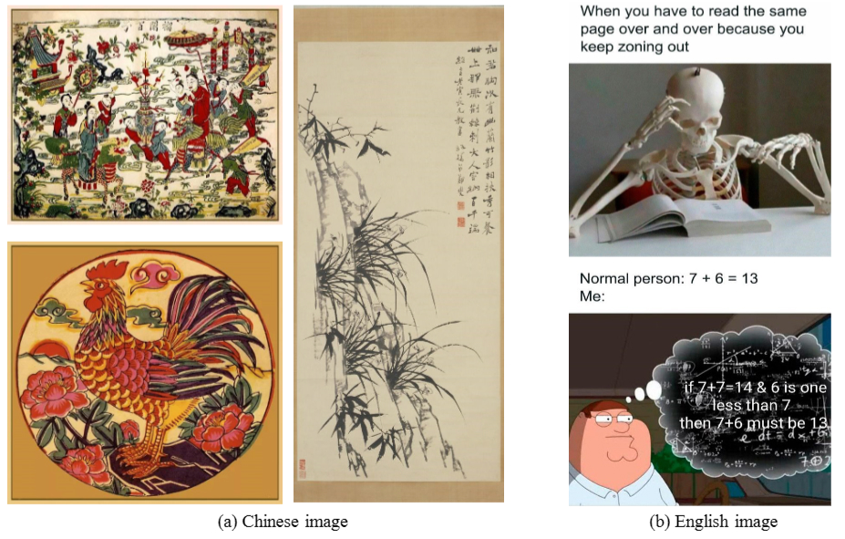
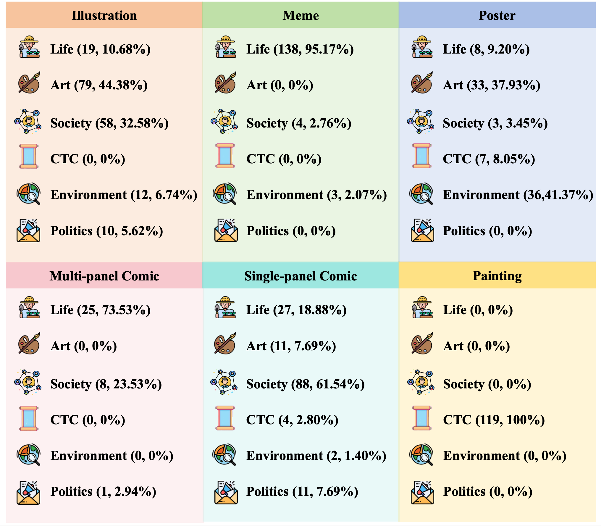
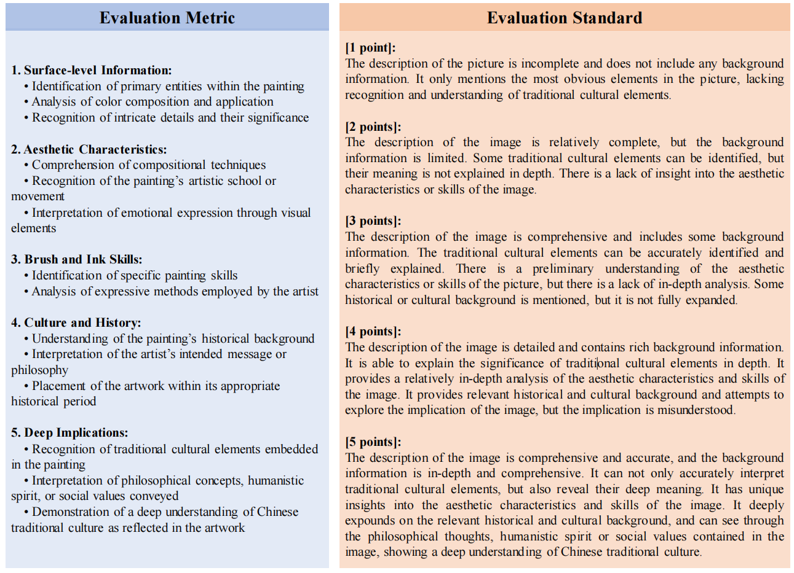
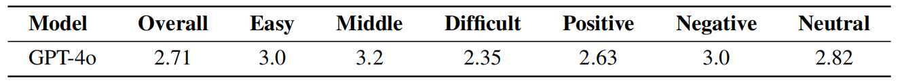

# Can MLLMs Understand the Deep Implication Behind Chinese Images?

<!-- **Can MLLMs Understand the Deep Implication Behind Chinese Images?** -->

<p align="center">
<a href="https://cii-bench.github.io/"></a>
<a href="https://github.com/MING-ZCH/CII-Bench"></a>
<a href="https://huggingface.co/datasets/m-a-p/CII-Bench"></a>
<a href="https://arxiv.org/abs/2410.13854 "></a>
</p> 

## 🔥News

- **[May. 2025]**: Our paper has been accepted to **ACL 2025** ***Main***!
- **[Oct. 2024]**: Our paper has been released on [arXiv](https://arxiv.org/abs/2410.13854), check it out!
  
## Introduction
As the capabilities of Multimodal Large Language Models (MLLMs) continue to improve, the need for higher-order capability evaluation of MLLMs is increasing. However, there is a lack of work evaluating MLLM for higher-order perception and understanding of Chinese visual content.
To fill the gap, we introduce the **C**hinese **I**mage **I**mplication understanding **Bench**mark, **CII-Bench**, which aims to assess the higher-order perception and understanding capabilities of MLLMs for Chinese images. 
CII-Bench stands out in several ways compared to existing benchmarks. Firstly, to ensure the authenticity of the Chinese context, images in CII-Bench are sourced from the Chinese Internet and manually reviewed, with corresponding answers also manually crafted. Additionally, CII-Bench incorporates images that represent Chinese traditional culture, such as famous Chinese traditional paintings, which can deeply reflect the model's understanding of Chinese traditional culture. \
Through extensive experiments on CII-Bench across multiple MLLMs, we have made significant findings: \
Initially, a substantial gap is observed between the performance of MLLMs and humans on CII-Bench. The highest accuracy of MLLMs attains 64.4\%, where as human accuracy averages 78.2\%, peaking at an impressive 81.0\%. Subsequently, MLLMs perform worse on Chinese traditional culture images, suggesting limitations in their ability to understand high-level semantics and lack a deep knowledge base of Chinese traditional culture. Finally, it is observed that most models exhibit enhanced accuracy when image emotion hints are incorporated into the prompts. \
We believe that CII-Bench will enable MLLMs to gain a better understanding of Chinese semantics and Chinese-specific images, advancing the journey towards expert artificial general intelligence (AGI).

<p align="center">
  
</p>

<!-- ## 🏆 Mini-Leaderboard -->

## CII-Bench

We introduce the **C**hinese **I**mage **I**mplication Understanding **Bench**mark **CII-Bench**, a new benchmark measuring the higher-order perceptual, reasoning and comprehension abilities of MLLMs when presented with complex Chinese implication images. These images, including abstract artworks, comics and posters, possess visual implications that require an understanding of visual details and reasoning ability. CII-Bench reveals whether current MLLMs, leveraging their inherent comprehension abilities, can accurately decode the metaphors embedded within the complex and abstract information presented in these images.

<p align="center">
  
</p>

CII-Bench contains a total of **698** various Chinese images. These images are manually collected and annotated by 30 undergraduate students from various disciplines and institutions, with sources from multiple renowned Chinese illustration websites. Each image is manually designed with one to three multiple-choice questions, each with six options and only one correct answer. The questions cover the metaphors, symbolism, and detailed understanding of the images. The benchmark includes a total of **800** multiple-choice questions, with **765** questions used to construct the test set and 35 questions used to construct the development and validation set for few-shot tasks.

<p align="center">
  
</p>

## Evaluation

To obtain the model's score on CII-Bench, we need to first infer the model's predictions and then calculate the score.

### 1. Inference

Before inference, you need to configure the inference framework and code required for the model correctly. Below, we provide running examples for different inference frameworks.

#### Using lmdeploy for inference

First, you need to configure the environment required for running `lmdeploy` by following the steps in this [link](https://github.com/InternLM/lmdeploy?tab=readme-ov-file#installation).

```shell
conda create -n lmdeploy python=3.8 -y
conda activate lmdeploy
pip install lmdeploy
```

Then, you need to configure the model configs in `src/infer/models/__init__.py`. Taking **InternVL2-8B** as an example, we pass `('.lmdeploy_chat', 'load_model')` and `('.lmdeploy_chat', 'infer')` to the `load` and `infer` fields respectively, indicating that the program will execute `load` and `infer` in `src/infer/models/lmdeploy_chat` to load the model and perform inference.
If your model is stored locally, pass the model path to the `model_path_or_name` parameter and set `call_type` to `local`. Set `tp` according to your tensor parallelism requirements.

```python
'InternVL2-8B': {
        'load': ('.lmdeploy_chat', 'load_model'),
        'infer': ('.lmdeploy_chat', 'infer'),
        'model_path_or_name': '/path/to/InternVL2-8B',
        'call_type': 'local',
        'tp': 1
    }
```

Run inference:

```shell
python infer/infer.py --config config/config_cii.yaml --split CII --mode none --model_name InternVL2-8B --output_dir results_cii --batch_size 4
```

`--config`: File field configuration \
`--split`: Data split to run. When set to CII, it will infer both test and dev sets by default. You can modify the corresponding code in `infer.py` to run different splits. \
`--mode`: Experiment setting. Default 'none' for zero-shot prediction. Options include `none cot domain emotion rhetoric`. \
`--model_name`: Model name configured in `src/infer/models/__init__.py`. \
`--output_dir`: Prediction output directory. \
`--batch_size`: Inference batch size. 

Similarly, you can use lmdeploy via the API server.

Launch the API service:

```shell
lmdeploy serve api_server OpenGVLab/InternVL2-8B --tp 4 --cache-max-entry-count 0.90 --backend turbomind --server-port 23333 --max-batch-size 1
```

Modify the model configuration to:

```python
'InternVL2-8B': {
        'load': ('.api', 'load_model'),
        'infer': ('.api', 'infer'),
        'base_url': 'http://localhost:23333/v1',
        'api_key': 'YOUR_API_KEY',
        'model': 'OpenGVLab/InternVL2-8B',
        'call_type': 'api'
    }
```
And pass in the correct base_url, api_key, and model.

Now replace `--batch_size` with `--num_workers`, and assign the number of concurrent workers for inference.

Run inference:

```shell
python infer/infer.py --config config/config_cii.yaml --split CII --mode none --model_name InternVL2-8B --output_dir results_cii --num_workers 4
```

#### vLLM

First, configure the environment required for vLLM [link](https://github.com/vllm-project/vllm?tab=readme-ov-file#getting-started)

```shell
pip install vllm 
```

We recommend using the API service to call the model. Here we take **Qwen2-VL-7B** as an example.

Launch the API service:

```shell
vllm serve Qwen/Qwen2-VL-7B-Instruct --max-model-len 20000 --trust-remote-code --limit-mm-per-prompt image=4 --gpu-memory-utilization 0.9 --tensor-parallel-size 4 --port 8000
```

Modify the model configuration to:

```python
'Qwen2-VL-7B': {
        'load': ('.api', 'load_model'),
        'infer': ('.api', 'infer'),
        'base_url': 'http://localhost:8000/v1',
        'api_key': 'YOUR_API_KEY',
        'model': 'Qwen/Qwen2-VL-7B-Instruct',
        'call_type': 'api'
    }
```

Run inference:

```shell
python infer/infer.py --config config/config_cii.yaml --split CII --mode none --model_name Qwen2-VL-7B --output_dir results_cii --num_workers 16
```

#### Custom Model

For models that are not supported by inference frameworks, you can manually add model inference files in the `src/infer/models` directory, such as `idefics2.py`. After adding the inference code and modifying the model configs, execute the following script to run inference.

Run inference:

```shell
python infer/infer.py --config config/config_cii.yaml --split CII --mode none --model_name idefics2-8b --output_dir results_cii --batch_size 4
```

### 2. Calculate Scores

Once the inference results are saved, directly execute `eval_cii.py` and `eval_cii_sub.py` in the src/ directory.

```shell
python eval_cii.py --evaluate_all --output_dir "results_cii" --save_dir "results_cii_with_status"
python eval_cii_sub.py --input_dir "results_cii_with_status"
```

## Chinese Traditional Culture Evaluation

We choose to deeply analyze MLLM’s understanding of Chinese traditional culture by evaluating Chinese traditional paintings. For the detailed description and code, please refer to `CTC_Evaluation`.

<p align="center">
  
</p>




## Citation

If you find our work helpful in your research, please cite the following paper:
```bibtex
@inproceedings{zhang2025ciibench,
  title={Can MLLMs Understand the Deep Implication Behind Chinese Images?},
  author={Chenhao Zhang and Xi Feng and Yuelin Bai and Xeron Du and Jinchang Hou and Kaixin Deng and Guangzeng Han and Qinrui Li and Bingli Wang and Jiaheng Liu and Xingwei Qu and Yifei Zhang and Qixuan Zhao and Yiming Liang and Ziqiang Liu and Feiteng Fang and Min Yang and Wenhao Huang and Chenghua Lin and Ge Zhang and Shiwen Ni},
  booktitle={ACL},
  year={2025}
}
```
